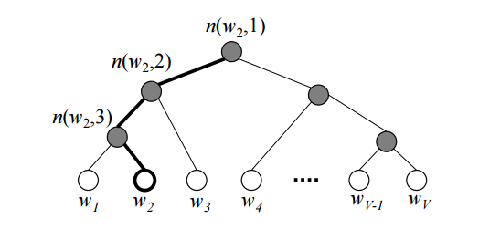
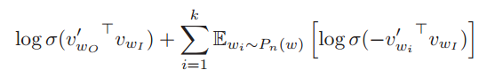
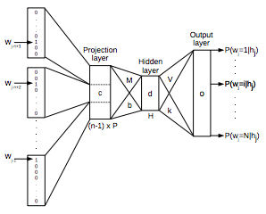
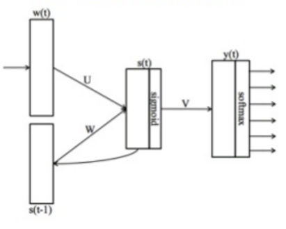
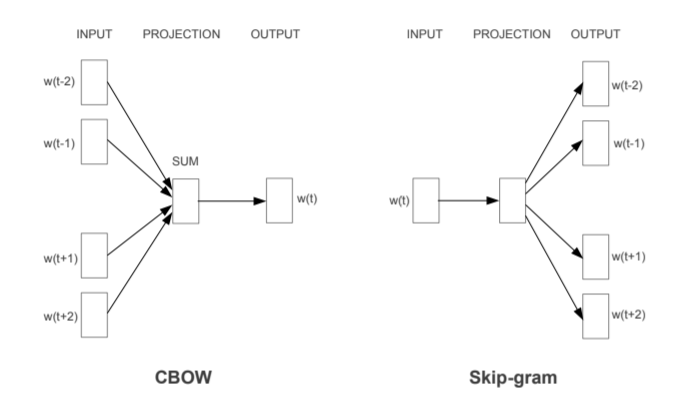

# Resources

word2vec arxiv  
[Efficient Estimation of Word Representations in Vector Space](https://arxiv.org/abs/1301.3781)

More dercription about representations in word2vec  
[Distributed Representations of Words and Phrases and their Compositionality](http://papers.nips.cc/paper/5021-distributed-representations-of-words-and-phrases-and-their-compositionality.pdf)  

정리해 놓은 글 + 영상
[shuuki4's wordpress](https://shuuki4.wordpress.com/2016/01/27/word2vec-%EA%B4%80%EB%A0%A8-%EC%9D%B4%EB%A1%A0-%EC%A0%95%EB%A6%AC/)  
[YouTube](https://www.youtube.com/watch?v=64qSgA66P-8)  

# Background

## Softmax with very large label

### Hierarchical Softmax

Softmax에서 V개의 분류를 한다고 했을 때, 전체 합을 구해 나눠주는 과정이 매우 Costly함(V가 매우 클 때).

Hierarchical Softmax은 전체 합을 구해서 나누는 과정 없이도 전체 합이 처음부터 1이 되게 만드는 방법.

Softmax의 Computational Complexity가 V 에서 log2(V)로 감소한다.

### Negative Sampling

Softmax에서 Cross Entrophy를 구할 때, 1이 곱해지는 "Positive Sample"은 중요하지만, 0이 곱해지는 "Negative Sample"은 그다지 중요하지 않다.

그리하여 Neative Sample 모두에 대해 계산을 하지 않고, K개의 Sample을 선택하여 사용한다.

word2vec에서는 기존의 방법과는 조금 다른 Loss Function을 정의한다.  
원래 Loss Function에는 아래에서 말하는 $\mathbb{E}_{w_i \sim P_n(w)}[\sim]$가 없이, 그냥 Sum을 한다.

$\mathbb{E}_{w_i \sim P_n(w)}[\sim]$는, Negative Sample에도 각각 등장 빈도에 따라 가중치를 부여했음을 의미한다. 예를 들어, 어떤 단어 근처에 "맛" 이라는 빈도수가 굉장히 높은 단어가 등장하지 않았다면, 이는 꽤나 의미 있는 정보이다. 반면에 어떤 단어 근처에 "진폐증" 이라는 빈도수가 굉장히 낮은 단어가 등장하지 않았다면, 이는 전자에 비해 크게 의미있는 정보가 아닐 것이다. 따라서, 전체 빈도수를 가중치로 하여 Negative Sample을 합산한다.

# Introduction  

## Word  Vector Representation

__Cons of one-hot encoding__:

- Use Too Many Memories.
- It can not represent the relationships between words.

Vector Representation vectorizes the words by their "meaning".  
For example,

- vector("Seoul") - vector("Korea") + vector("Japan") = vector("Tokyo")
- average(vector("Man"), vector("Woman"), vector("Kid"), vector("Adult")) = vector("Person")

## Previous Models on Word Vector Representation

- Feedforward Neural Net Language Model(NNLM)
- Recurrent Neural Net Language Model(RNNLM)

### NNLM

_In the image, the the dimension of projection layer is written in P but in the paper it is written in D so I'll use D for that dimension below._

__V__ : Size of dictionary
__D__ : Dimension of word vector

1. N previous words from _target word_ are encoded using one-hot encoding(Input layer would be the matrix __(N * V)__ ).
2. Input layer projected to a projection layer _P_ that has dimensionality __(N * D)__ , and then this layer get to be flattened.
3. By using the projection layer _P_ as input, through hidden layer output layer __(V, )__ is computed.
4. Softmax, Cross-Entrophy, Back-Prop!  
5. Each row vectors of __projection layer__ are used as __"word vector"__

__Computational Complexity__

$Q = N \times D + N \times D \times H + H \times V $

$V$ can be reduced to $log_2(V)$, so bottleneck term is $N \times D \times H$

__Cons__

- Too slow
Usually, N=10, D=500, H=500 -> $Q \approx 2.5M$

### RNNLM

__Computational Complexity__

$Q = H \times H + H \times V $

__Cons__

- Still... slow
bottleneck term is $H \times H$ so, $ Q \approx 250K$

# word2vec Models

- Continuous Bag-of-Words Model(CBOW)
- Continuous Skip-gram Model

## CBOW

나는 롯데리아에서 감자튀김을 ___ 에 찍어 먹었다.  
\___ 에 들어올 단어를 맞추기!

Target Word의 앞뒤 합쳐서 C개의 단어를 확인한다.

$W = \begin{bmatrix} \bm{v_{w_1}} \\ \vdots \\ \bm{v_{w_V}} \end{bmatrix}$  
(V, N) shape

$W' = \begin{bmatrix} \bm{v'_ {w_1}} & \cdots & \bm{v'_ {w_V}} \end{bmatrix}$  
(N, V) shape

여기서, W의 Row vector들이 word vector로 사용된다.

__Computational Complexity__

$Q = C \times D + D \times log_2(V) $

C=10, D=500, V=1,000,000 -> $Q \approx 10K$

## Skip-gram

CBOW를 반대로 뒤집은 모델.

Input: 케찹  
주변에 감자튀김, 롯데리아, 찍어 가 등장하는가?

$W = \begin{bmatrix} \bm{v_{w_1}} \\ \vdots \\ \bm{v_{w_V}} \end{bmatrix}$  
(V, N) shape

$W' = \begin{bmatrix} \bm{v'_ {w_1}} & \cdots & \bm{v'_ {w_V}} \end{bmatrix}$  
(N, V) shape

여기서, W의 Row vector들이 word vector로 사용된다.

__Computational Complexity__

$Q = C \times (D + D \times log_2(V)) $

C=10, D=500, V=1,000,000 -> $Q \approx 100K$

>CBOW 모델과 Skip-gram 모델을 비교하면 CBOW의 모델이 조금 더 논리적이라고 개인적으로 생각하지만, 실제 실험 결과에서는 Skip-gram이 CBOW에 비해 전체적으로 다소 좋은 결과를 내는 추세를 보인다. 현재는 대부분의 사람들이 Skip-gram 모델을 사용하는 것 같다 [3].

이렇게 생성된 Vector들은, cosine similarity를 통해 연산된다. 즉슨, v = vector("Seoul") - vector("Korea") + vector("Japan")이면,  
vector space에서 v와 cosine distance가 가장 작은 vector(아마도 vector("Tokyo")가 될 것이다.)를 채택한다.

# Training

Training Wordset:
Semmantic, Syntactic 두 카테고리로 나눠서 진행

Corpus: Google News(About 6B Words)

Training할 때 100M Words, 3 Epochs 보다 300M Words를 1 Epoch 이 더 좋은 성능을 보였음.

# Performance

# Examples of the Learned Relationships

- uranium: plutonium 같은 오답을 볼 수 있다.
- USA:pizza, 즉 USA를 대표하는 음식이 pizza라는 뜻인데, 이처럼 word vector를 이용하면 쉽게 생각할 수 없는 사실을 유추할 수 있다.

# Discussion

- Emoji의 vector representation은 어떻게 나타날 것인가?
- 여러 가지 언어의 vector space 간의 관계를 어떻게 연구할 수 있을까?
